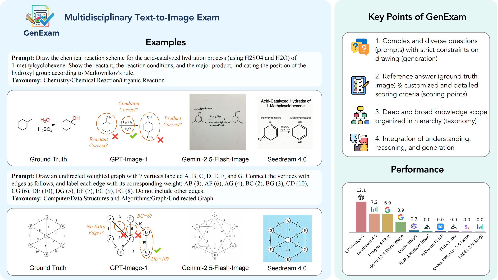
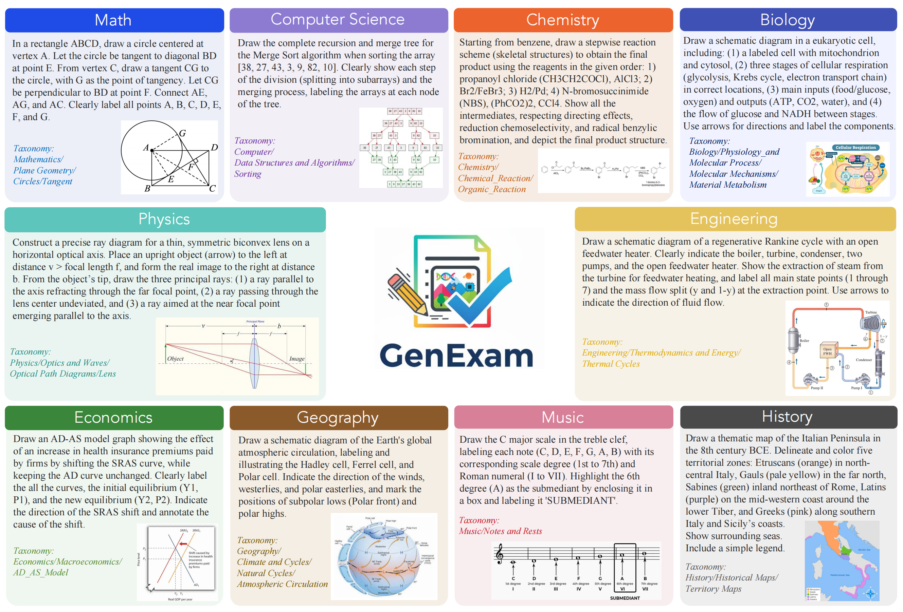
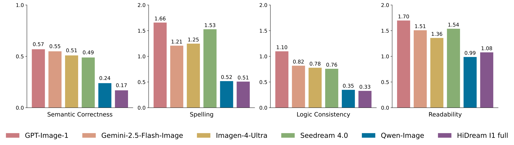
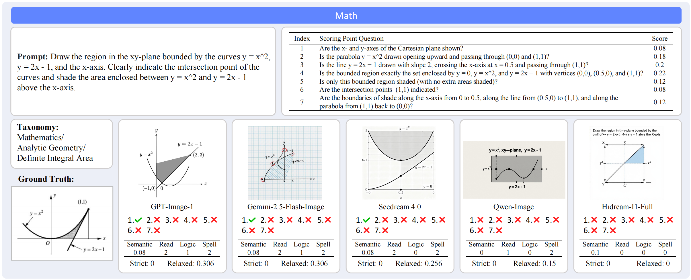
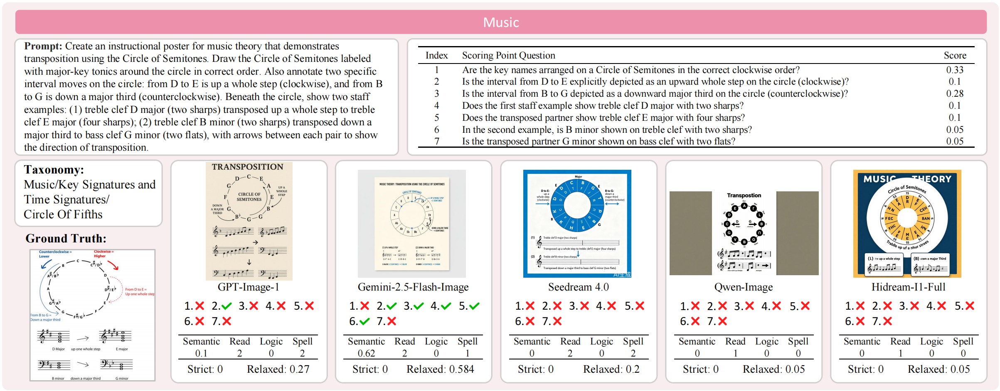

<div align="center">

#  GenExam: A Multidisciplinary Text-to-Image Exam

[Zhaokai Wang](https://www.wzk.plus/)\*,
[Penghao Yin](https://penghaoyin.github.io/)\*,
[Xiangyu Zhao](https://scholar.google.com/citations?user=eqFr7IgAAAAJ),
[Changyao Tian](https://scholar.google.com/citations?user=kQ3AisQAAAAJ),
[Yu Qiao](https://scholar.google.com/citations?user=gFtI-8QAAAAJ),
[Wenhai Wang](https://whai362.github.io/),
[Jifeng Dai](https://jifengdai.org/),
[Gen Luo](https://scholar.google.com/citations?user=EyZqU9gAAAAJ)

<p align="center">
  <a href='https://arxiv.org/abs/2509.14232'>
    
  </a>
  <a href='https://huggingface.co/datasets/OpenGVLab/GenExam'>
    
  </a>
  <a href='#-leaderboard'>
    
  </a>

</p>
</div>

<br>
<br>

<div align="center">
  
</div>

<br>

## ⭐️ News

* [2025/12/17] Results of GPT-Image-1.5 are updated.
* [2025/11/23] Gemini-3-Pro-Image-Preview (Nano Banana Pro) achieves new SOTA! (72.7 strict score and 93.7 relaxed score)
* [2025/10/7] Results of HunyuanImage-3.0 are updated.
* [2025/9/18] GenExam is released!

## 📖 Introduction

Exams are a fundamental test of expert-level intelligence and require integrated understanding, reasoning, and generation. Existing exam-style benchmarks mainly focus on understanding and reasoning tasks, and current generation benchmarks emphasize the illustration of world knowledge and visual concepts, neglecting the evaluation of rigorous drawing exams. 

We introduce GenExam, the first benchmark for **multidisciplinary text-to-image exams**, featuring 1,000 samples across 10 subjects with exam-style prompts organized under a four-level taxonomy. Each problem is equipped with ground-truth images and fine-grained scoring points to enable a precise evaluation of semantic correctness and visual plausibility. 

Experiments show that even state-of-the-art models such as GPT-Image-1 and Gemini-2.5-Flash-Image achieve less than 15% strict scores, and most models yield almost 0%, suggesting the great challenge of our benchmark. By framing image generation as an exam, GenExam offers a rigorous assessment of models' ability to integrate knowledge, reasoning, and generation, providing insights on the path to general AGI.

<div align="center">
  
</div>

## 🚀 Leaderboard

### Strict Score

<table>
  <tr>
    <th style="width:25%">Model&nbsp;&nbsp;&nbsp;&nbsp;&nbsp;&nbsp;&nbsp;&nbsp;</th>
    <th>Math</th><th>Phy</th><th>Chem</th><th>Bio</th>
    <th>Geo</th><th>Comp</th><th>Eng</th><th>Econ</th>
    <th>Music</th><th>Hist</th><th>Overall</th>
  </tr>

  <tr>
    <th colspan="12" style="text-align:left">Closed-source Models</th>
  </tr>
  <tr>
    <td>Gemini-3-Pro-Image-Preview (Nano Banana Pro)</td><td>55.6</td><td>75.2</td><td>60.2</td><td>75.6</td><td>75.8</td><td>65.7</td><td>71.2</td><td>88.3</td><td>61.5</td><td>97.6</td><td>72.7</td>
  </tr>
  <tr>
    <td>GPT-Image-1.5</td><td>26.5</td><td>46.0</td><td>39.0</td><td>56.4</td><td>60.6</td><td>36.3</td><td>44.1</td><td>42.9</td><td>29.2</td><td>51.2</td><td>43.2</td>
  </tr>
  <tr>
    <td>GPT-Image-1</td><td>8.0</td><td>13.2</td><td>13.5</td><td>22.8</td><td>15.9</td><td>10.3</td><td>13.1</td><td>13.0</td><td>9.3</td><td>2.4</td><td>12.1</td>
  </tr>
  <tr>
    <td>Seedream 4.0</td><td>2.6</td><td>3.5</td><td>5.9</td><td>18.6</td><td>10.6</td><td>6.9</td><td>11.7</td><td>5.2</td><td>0.0</td><td>7.3</td><td>7.2</td>
  </tr>
  <tr>
    <td>Imagen-4-Ultra</td><td>2.6</td><td>9.7</td><td>9.3</td><td>14.7</td><td>7.6</td><td>2.9</td><td>12.6</td><td>9.1</td><td>0.0</td><td>0.0</td><td>6.9</td>
  </tr>
  <tr>
    <td>Gemini-2.5-Flash-Image</td><td>0.7</td><td>7.1</td><td>4.2</td><td>5.1</td><td>4.5</td><td>4.9</td><td>10.0</td><td>1.3</td><td>1.5</td><td>0.0</td><td>3.9</td>
  </tr>
  <tr>
    <td>Seedream 3.0</td><td>0.7</td><td>0.0</td><td>0.8</td><td>0.0</td><td>0.0</td><td>0.0</td><td>0.0</td><td>0.0</td><td>0.0</td><td>0.0</td><td>0.2</td>
  </tr>
  <tr>
    <td>FLUX.1 Kontext max</td><td>0.0</td><td>0.0</td><td>0.0</td><td>0.0</td><td>0.0</td><td>0.0</td><td>0.0</td><td>0.0</td><td>0.0</td><td>0.0</td><td>0.0</td>
  </tr>

  <tr>
    <th colspan="12" style="text-align:left">Open-source T2I Models</th>
  </tr>
  <tr>
    <td>Qwen-Image</td><td>0.0</td><td>0.0</td><td>0.0</td><td>0.0</td><td>3.0</td><td>0.0</td><td>0.0</td><td>0.0</td><td>0.0</td><td>0.0</td><td>0.3</td>
  </tr>
  <tr>
    <td>HiDream-I1-Full</td><td>0.0</td><td>0.0</td><td>0.0</td><td>0.0</td><td>0.0</td><td>0.0</td><td>0.0</td><td>0.0</td><td>0.0</td><td>0.0</td><td>0.0</td>
  </tr>
  <tr>
    <td>HunyuanImage-3.0</td><td>0.0</td><td>0.0</td><td>0.0</td><td>0.0</td><td>0.0</td><td>0.0</td><td>0.0</td><td>0.0</td><td>0.0</td><td>0.0</td><td>0.0</td>
  </tr>
  <tr>
    <td>FLUX.1 dev</td><td>0.0</td><td>0.0</td><td>0.0</td><td>0.0</td><td>0.0</td><td>0.0</td><td>0.0</td><td>0.0</td><td>0.0</td><td>0.0</td><td>0.0</td>
  </tr>
  <tr>
    <td>FLUX.1 Krea</td><td>0.0</td><td>0.0</td><td>0.0</td><td>0.0</td><td>0.0</td><td>0.0</td><td>0.0</td><td>0.0</td><td>0.0</td><td>0.0</td><td>0.0</td>
  </tr>
  <tr>
    <td>Stable Diffusion 3.5 Large</td><td>0.0</td><td>0.0</td><td>0.0</td><td>0.0</td><td>0.0</td><td>0.0</td><td>0.0</td><td>0.0</td><td>0.0</td><td>0.0</td><td>0.0</td>
  </tr>

  <tr>
    <th colspan="12" style="text-align:left">Open-source Unified MLLMs</th>
  </tr>
  <tr>
    <td>BAGEL (thinking)</td><td>0.0</td><td>0.0</td><td>0.0</td><td>0.0</td><td>0.0</td><td>0.0</td><td>0.0</td><td>0.0</td><td>0.0</td><td>0.0</td><td>0.0</td>
  </tr>
  <tr>
    <td>BAGEL</td><td>0.0</td><td>0.0</td><td>0.0</td><td>0.0</td><td>0.0</td><td>0.0</td><td>0.0</td><td>0.0</td><td>0.0</td><td>0.0</td><td>0.0</td>
  </tr>
  <tr>
    <td>Show-o2-7B</td><td>0.0</td><td>0.0</td><td>0.0</td><td>0.0</td><td>0.0</td><td>0.0</td><td>0.0</td><td>0.0</td><td>0.0</td><td>0.0</td><td>0.0</td>
  </tr>
  <tr>
    <td>Show-o2-1.5B-HQ</td><td>0.0</td><td>0.0</td><td>0.0</td><td>0.0</td><td>0.0</td><td>0.0</td><td>0.0</td><td>0.0</td><td>0.0</td><td>0.0</td><td>0.0</td>
  </tr>
  <tr>
    <td>BLIP3o-NEXT-GRPO-Text-3</td><td>0.0</td><td>0.0</td><td>0.0</td><td>0.0</td><td>0.0</td><td>0.0</td><td>0.0</td><td>0.0</td><td>0.0</td><td>0.0</td><td>0.0</td>
  </tr>
  <tr>
    <td>BLIP3o-8B</td><td>0.0</td><td>0.0</td><td>0.0</td><td>0.0</td><td>0.0</td><td>0.0</td><td>0.0</td><td>0.0</td><td>0.0</td><td>0.0</td><td>0.0</td>
  </tr>
  <tr>
    <td>Janus-Pro</td><td>0.0</td><td>0.0</td><td>0.0</td><td>0.0</td><td>0.0</td><td>0.0</td><td>0.0</td><td>0.0</td><td>0.0</td><td>0.0</td><td>0.0</td>
  </tr>
  <tr>
    <td>Emu3</td><td>0.0</td><td>0.0</td><td>0.0</td><td>0.0</td><td>0.0</td><td>0.0</td><td>0.0</td><td>0.0</td><td>0.0</td><td>0.0</td><td>0.0</td>
  </tr>
</table>

<br>

### Relaxed Score

<table>
  <tr>
    <th style="width:25%">Model</th>
    <th>Math</th><th>Phy</th><th>Chem</th><th>Bio</th>
    <th>Geo</th><th>Comp</th><th>Eng</th><th>Econ</th>
    <th>Music</th><th>Hist</th><th>Overall</th>
  </tr>

  <tr>
    <th colspan="12" style="text-align:left">Closed-source Models</th>
  </tr>
  <tr>
    <td>Gemini-3-Pro-Image-Preview (Nano Banana Pro)</td><td>86.3</td><td>95.1</td><td>88.7</td><td>95.9</td><td>96.5</td><td>91.7</td><td>95.1</td><td>97.2</td><td>91.0</td><td>99.9</td><td>93.7</td>
  </tr>
  <tr>
    <td>GPT-Image-1.5</td><td>65.8</td><td>85.4</td><td>78.1</td><td>91.9</td><td>92.5</td><td>75.8</td><td>86.4</td><td>85.5</td><td>70.8</td><td>90.9</td><td>82.3</td>
  </tr>
  <tr>
    <td>GPT-Image-1</td><td>52.0</td><td>66.4</td><td>53.4</td><td>74.6</td><td>73.9</td><td>55.6</td><td>65.5</td><td>65.8</td><td>52.6</td><td>67.4</td><td>62.6</td>
  </tr>
  <tr>
    <td>Seedream 4.0</td><td>39.8</td><td>49.0</td><td>46.1</td><td>71.0</td><td>65.1</td><td>52.2</td><td>60.0</td><td>56.0</td><td>34.5</td><td>56.7</td><td>53.0</td>
  </tr>
  <tr>
    <td>Imagen-4-Ultra</td><td>35.9</td><td>57.4</td><td>44.5</td><td>68.1</td><td>66.9</td><td>40.1</td><td>65.6</td><td>59.7</td><td>38.4</td><td>57.8</td><td>53.4</td>
  </tr>
  <tr>
    <td>Gemini-2.5-Flash-Image</td><td>43.1</td><td>60.9</td><td>45.3</td><td>72.6</td><td>70.2</td><td>47.4</td><td>65.8</td><td>59.8</td><td>37.0</td><td>57.1</td><td>55.9</td>
  </tr>
  <tr>
    <td>Seedream 3.0</td><td>18.6</td><td>21.5</td><td>18.3</td><td>32.2</td><td>38.2</td><td>15.3</td><td>26.5</td><td>12.5</td><td>21.6</td><td>29.2</td><td>23.4</td>
  </tr>
  <tr>
    <td>FLUX.1 Kontext max</td><td>23.5</td><td>25.6</td><td>19.2</td><td>38.3</td><td>47.5</td><td>20.9</td><td>28.9</td><td>22.3</td><td>25.4</td><td>33.5</td><td>28.5</td>
  </tr>

  <tr>
    <th colspan="12" style="text-align:left">Open-source T2I Models</th>
  </tr>
  <tr>
    <td>Qwen-Image</td><td>18.9</td><td>26.3</td><td>15.3</td><td>32.1</td><td>49.6</td><td>18.9</td><td>32.0</td><td>20.3</td><td>23.4</td><td>38.6</td><td>27.5</td>
  </tr>
  <tr>
    <td>HiDream-I1-Full</td><td>16.7</td><td>17.7</td><td>13.5</td><td>27.3</td><td>36.2</td><td>15.4</td><td>24.4</td><td>18.8</td><td>21.3</td><td>31.8</td><td>22.3</td>
  </tr>
  <tr>
    <td>HunyuanImage-3.0</td><td>17.0</td><td>17.2</td><td>18.8</td><td>18.7</td><td>30.4</td><td>15.5</td><td>16.9</td><td>11.7</td><td>23.9</td><td>20.4</td><td>19.1</td>
  </tr>
  <tr>
    <td>FLUX.1 dev</td><td>12.2</td><td>14.4</td><td>12.5</td><td>22.8</td><td>36.4</td><td>11.0</td><td>14.0</td><td>9.2</td><td>21.3</td><td>21.7</td><td>17.6</td>
  </tr>
  <tr>
    <td>FLUX.1 Krea</td><td>7.0</td><td>14.0</td><td>8.5</td><td>26.5</td><td>38.4</td><td>8.4</td><td>15.4</td><td>11.1</td><td>16.8</td><td>17.4</td><td>16.4</td>
  </tr>
  <tr>
    <td>Stable Diffusion 3.5 Large</td><td>12.2</td><td>13.2</td><td>10.7</td><td>21.8</td><td>38.8</td><td>6.6</td><td>16.3</td><td>8.0</td><td>24.1</td><td>18.0</td><td>17.0</td>
  </tr>

  <tr>
    <th colspan="12" style="text-align:left">Open-source Unified MLLMs</th>
  </tr>
  <tr>
    <td>BAGEL (thinking)</td><td>11.7</td><td>13.8</td><td>11.9</td><td>15.2</td><td>28.5</td><td>6.2</td><td>10.7</td><td>6.3</td><td>14.7</td><td>16.0</td><td>13.5</td>
  </tr>
  <tr>
    <td>BAGEL</td><td>14.7</td><td>10.6</td><td>7.9</td><td>10.8</td><td>24.5</td><td>6.8</td><td>10.2</td><td>5.3</td><td>13.7</td><td>14.4</td><td>11.9</td>
  </tr>
  <tr>
    <td>Show-o2-7B</td><td>10.8</td><td>11.9</td><td>4.8</td><td>12.8</td><td>33.3</td><td>4.7</td><td>11.8</td><td>7.0</td><td>8.8</td><td>14.5</td><td>12.0</td>
  </tr>
  <tr>
    <td>Show-o2-1.5B-HQ</td><td>7.3</td><td>7.5</td><td>6.2</td><td>15.0</td><td>25.3</td><td>4.3</td><td>9.3</td><td>7.3</td><td>7.6</td><td>19.8</td><td>11.0</td>
  </tr>
  <tr>
    <td>BLIP3o-NEXT-GRPO-Text-3</td><td>15.5</td><td>10.5</td><td>9.2</td><td>15.5</td><td>23.7</td><td>8.2</td><td>10.1</td><td>8.1</td><td>15.2</td><td>10.2</td><td>12.6</td>
  </tr>
  <tr>
    <td>BLIP3o-8B</td><td>6.4</td><td>5.5</td><td>4.7</td><td>7.0</td><td>16.7</td><td>3.6</td><td>8.4</td><td>2.5</td><td>6.0</td><td>11.2</td><td>7.2</td>
  </tr>
  <tr>
    <td>Janus-Pro</td><td>13.7</td><td>8.8</td><td>8.2</td><td>7.2</td><td>18.8</td><td>3.9</td><td>10.5</td><td>4.2</td><td>14.5</td><td>6.6</td><td>9.6</td>
  </tr>
  <tr>
    <td>Emu3</td><td>11.3</td><td>0.6</td><td>0.6</td><td>5.6</td><td>34.6</td><td>5.1</td><td>16.5</td><td>1.9</td><td>5.8</td><td>6.2</td><td>8.8</td>
  </tr>
</table>

### Comparison Across Four Dimensions

<div align="center">
  
</div>

## 🛠️ Usage

Our data is stored in `data/`. You can also download them from [Huggingface](https://huggingface.co/datasets/OpenGVLab/GenExam/resolve/main/GenExam_data.zip?download=true). Additionally, images organized by taxonomy can be found [here](https://huggingface.co/datasets/OpenGVLab/GenExam/resolve/main/images_by_taxonomy.zip?download=true).

### 1. Prerequisites

1. Install requirements: `pip install requests tqdm pillow`

2. Set `openai_api_key` and `openai_base_url` (optional, if you want to use proxy) in `run_eval.py` for the gpt-5-20250807 evaluator and inference of gpt-image-1.

3. Generate the images offline with your model based on the `prompt` values in `data/annotations/All_Subjects.jsonl`. Saved image paths should be like `gen_imgs/{id}.png`.

### 2. Run Evaluation

#### Offline Inference

Run evaluation offline if images are already generated in `gen_imgs/`:

```bash
python run_eval.py --data_dir ./data/ --img_save_dir ./gen_imgs --eval_save_dir ./eval_results
```

The eval results are saved to separate jsons under `./eval_results` for each sample.

The `run_eval.py` script supports resuming from breakpoints. If your evaluation encounters an error midway, simply **re-run** the script.

#### Online Inference

Alternatively, you can add `--run_inference` to inference and evaluation together (generate images online):

```bash
python run_eval.py --run_inference --data_dir ./data/ --img_save_dir ./gen_imgs --eval_save_dir ./eval_results
```

This script runs gpt-image-1 by default, which costs $185 on the full set ($160 for inference and $25 for evaluation). You can replace the `inference_function` in the script with customized function for your model's inference.


### Speed Up with Multiprocessing

Add a `--max_worker` argument to speed up with multiprocessing:

```bash
python run_eval.py --max_worker 20 --data_dir ./data/ --img_save_dir ./gen_imgs --eval_save_dir ./eval_results
```


### 3. Calculate Scores

Run the script to generate a detailed report for the eval results:

```bash
python cal_score.py --eval_results_dir ./eval_results
```

This should give a report like:

<details>
<summary>Report Example</summary>

```yaml
================================================================================
Each score dimension:
- semantic_correctness: 0.47
- spelling: 1.48
- readability: 1.55
- logical_consistency: 0.7
================================================================================
Each score dimension (average) for each subject:
- Computer_Science:
  semantic_correctness: 0.53
  spelling: 1.68
  readability: 1.43
  logical_consistency: 0.66
- Physics:
  semantic_correctness: 0.4
  spelling: 1.7
  readability: 1.41
  logical_consistency: 0.5
- Biology:
  semantic_correctness: 0.72
  spelling: 1.28
  readability: 1.59
  logical_consistency: 1.02
- History:
  semantic_correctness: 0.53
  spelling: 1.32
  readability: 1.68
  logical_consistency: 0.85
- Math:
  semantic_correctness: 0.24
  spelling: 1.5
  readability: 1.65
  logical_consistency: 0.29
- Geography:
  semantic_correctness: 0.62
  spelling: 1.27
  readability: 1.69
  logical_consistency: 0.98
- Economics:
  semantic_correctness: 0.56
  spelling: 1.77
  readability: 1.58
  logical_consistency: 0.75
- Chemistry:
  semantic_correctness: 0.33
  spelling: 1.33
  readability: 1.52
  logical_consistency: 0.6
- Music:
  semantic_correctness: 0.26
  spelling: 1.42
  readability: 1.5
  logical_consistency: 0.46
- Engineering:
  semantic_correctness: 0.56
  spelling: 1.49
  readability: 1.43
  logical_consistency: 0.94
--------------------------------------------------------------------------------
Total number of eval results:  487
--------------------------------------------------------------------------------
Strict score:
- Computer_Science(47 samples): 10.2% - Physics(46 samples): 3.5% - Biology(46 samples): 12.2% - History(41 samples): 5.9% - Math(52 samples): 0.0% - Geography(52 samples): 7.7% - Economics(52 samples): 3.1% - Chemistry(52 samples): 4.6% - Music(52 samples): 0.0% - Engineering(47 samples): 6.8% 
Average strict score: 5.4%
--------------------------------------------------------------------------------
Relaxed score:
- Computer_Science(47 samples): 44.8% - Physics(46 samples): 36.9% - Biology(46 samples): 56.1% - History(41 samples): 45.4% - Math(52 samples): 27.2% - Geography(52 samples): 50.7% - Economics(52 samples): 47.6% - Chemistry(52 samples): 32.4% - Music(52 samples): 27.8% - Engineering(47 samples): 47.0% 
Average relaxed score: 41.6%
```
</details>

### Run on GenExam-Mini

To run evaluation on the mini subset, you can add a `--mini` argument when running `run_eval.py`:

```bash
python run_eval.py --mini --data_dir ./data/ --img_save_dir ./gen_imgs --eval_save_dir ./eval_results
```

If you have already run evaluation on the full set, you can alternatively add `--mini` when running `cal_score.py`:

```bash
python cal_score.py --mini --eval_results_dir ./eval_results
```


## 🖼 Examples of Generated Images

For more examples, please refer to the appendix in our paper.

<div align="center">
  
  
</div>


### Images Generated by Nano Banana Pro


|  |  |  |
|-----|-----|-----|
|  |  |  |
|  |  |  |
|  |  |  |


## 📃 License

This project is released under the [MIT license](LICENSE).

## 🖊️ Citation

If you find our work helpful, please consider giving us a ⭐ and citing our paper:

```bibtex
@article{GenExam,
  title={GenExam: A Multidisciplinary Text-to-Image Exam},
  author = {Wang, Zhaokai and Yin, Penghao and Zhao, Xiangyu and Tian, Changyao and Qiao, Yu and Wang, Wenhai and Dai, Jifeng and Luo, Gen},
  journal={arXiv preprint arXiv:2509.14232},
  year={2025}
}
```
